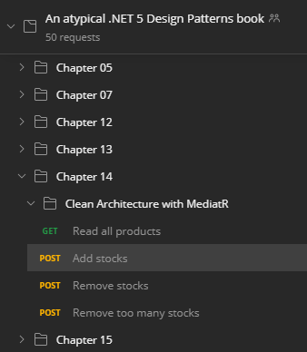

## $5 Tech Unlocked 2021!
[Buy and download this product for only $5 on PacktPub.com](https://www.packtpub.com/)
-----
*The $5 campaign         runs from __December 15th 2020__ to __January 13th 2021.__*

# Introduction

This repository contains the code of `An atypical .NET 5 Design Patterns book`.
It also contains pointers to help you find your way around the repository.
This repo is also there to rectify any mistake that could have been made in the book and missed during reviews.

Please open an issue if you find something missing from the instructions below or the book's instructions.

# Postman Collection

If you know Postman, or if you want to learn it, we have a collection of HTTP requests to query the various REST APIs created throughout the book.

Link: https://net5.link/postman

The structure is as follow:

The author built that collection to test the code himself while writing the book.
Since he needed it, we concluded that you could also find these requests useful during your journey.

If you think a request is missing or find an error, please open an issue to let us know.

# UML Diagrams

In the book, we have UML Class diagrams, UML Sequence Diagrams, and some non-UML diagrams.
We assumed that most-developers would know about UML, so we decided not to add pages about it.

The author used [diagrams.net (draw.io)](https://draw.io/) to draw the diagrams (which is free and open-source).
You can even load their editor in Visual Studio Code using the [Draw.io Integration](https://net5.link/w32e) extension.

<mark>TODO: write a short article</mark>

# Getting Started

1. You need a copy of `An atypical .NET 5 Design Patterns book` to make sense of the code projects as many projects start with bad code and get refactored into better ones.

    - <mark>TODO: add a link</mark>

1. You need an IDE/Text Editor like Visual Studio or Visual Studio Code, but you could do without (not recommended).

    - [Download Visual Studio](https://net5.link/VS)
    - [Download Visual Studio Code](https://net5.link/VSC)

1. You need .NET 5 SDK. If you installed Visual Studio, you should be fine. Otherwise, here is the link:

    - [Download .NET 5](https://net5.link/SDK)

With that in place, you should be good to go!

# Build and Test

All projects and solutions can be built using the .NET CLI or Visual Studio.
You can find the most useful commands in the introduction chapter, under `Running and building your program` or online.

The two commands that you will need are:

-   `dotnet build` to build a project or solution
-   `dotnet test` to run a test project or all tests of all test projects of a solution.

# Content/Code

Throughout the book, there are many projects, and it may become confusing to know what code block relates to what file in the Git repository.
Here we map the location of the code to its place in the book.
If at any point you are not sure, please have a look here.

1. <mark>TODO: map chapters and projects to code</mark>

If you find something missing or erroneous, please open an issue and let us know.

# Contribute

Please open an issue if you find some missing docs, errors in the source code, or a divergence between the book and the source code.

For more information, check out the [Code of conduct](CODE_OF_CONDUCT.md).
